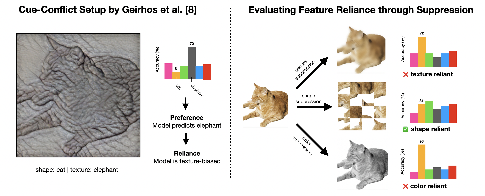

# B. Cross-Domain CLIP Similarity and Robust Fine-tuning

This folder contains **Contribution B** of the course project built on top of the feature-reliance codebase: cross-domain CLIP similarity analysis and robust fine-tuning across computer vision, medical imaging, and remote sensing datasets.

[](https://arxiv.org/abs/2509.20234)

[](https://github.com/tomburgert/feature-reliance)

For the combined project summary and headline results across both contributions, see the master README: [`../../README.md`](../../README.md).

## Overview

Burgert et al. introduce a controlled suppression framework that *measures* CNN feature reliance across shape, texture, and color cues. This contribution extends that framework in a new direction:

> **Can the same reliance protocol be generalized across modalities and paired with targeted robust fine-tuning strategies?**

Contribution B answers that by combining the paper's suppression-based evaluation with CLIP embedding analysis and domain-specific fine-tuning pipelines. The focus here is not only measuring cue dependence, but also identifying which augmentation strategy produces the strongest robustness profile for each domain.

This contribution includes:
- prompt engineering with CLIP on MS-COCO
- caption-based CLIP experiments for RetinaMNIST
- controlled-suppression training and inference pipelines for STL10, BloodMNIST, and DeepGlobe
- robust augmentation experiments tailored to each domain



## Relation to the Base Paper

The original paper’s **controlled suppression** protocol remains the backbone of this contribution:
- Train a model on a dataset.
- Suppress a cue at test time (shape / texture / color).
- Measure the performance drop to quantify reliance.

Key entry points:
- Training: `training.py`
- Evaluation / protocol: `reliance_protocol.py`
- Augmentations: `transform.py`

## What Contribution B Adds

On top of the base protocol, Contribution B adds:
- **Prompt engineering** with CLIP on COCO (no finetuning)
- **Caption generation + CLIP experiments** (RetinaMNIST)
- **CV, Medical, and Remote Sensing pipelines** with standardized scripts
- **Robust models** using combined cue augmentations

---

## Setup

Run these commands from [`contributions/2_contribution`](/mnt/volume/MAYURI/feature-reliance/Project/deep-learning-project/contributions/2_contribution).

```bash
# Create the environment
uv venv

# Activate it on Linux/macOS
source .venv/bin/activate

# Activate it on Windows
.\\.venv\\Scripts\\activate

# Install dependencies
uv pip install -r requirements.txt
```

If you need CUDA wheels, install PyTorch separately before installing requirements.

The `requirements.txt` in this folder includes the packages needed for the CLIP and DeepGlobe workflows used by Contribution B.

---

## Repository Structure

```
.
├─ conf/
├─ data/
├─ dataset/                  # downloaded datasets (ignored)
├─ logs_cv/                  # CV runs (ignored)
├─ logs_medical/             # medical runs (ignored)
├─ logs_radio_sensing/       # remote sensing runs (ignored)
├─ logs_prompt_eng/          # CLIP prompt engineering runs (ignored)
├─ scripts/
│  ├─ shell/                 # Linux/macOS shell scripts
│  └─ windows/               # Windows .bat scripts
├─ training.py
├─ reliance_protocol.py
└─ transform.py
```

---

## Data Preparation

### Computer Vision
- **Caltech101**, **Flowers102**, **OxfordPet**, and **STL10** are available via `torchvision.datasets` and download automatically.
- **ImageNet**: use the official ILSVRC 2012 split.

### Medical Imaging
- **MedMNIST** datasets (e.g., BloodMNIST, RetinaMNIST) are handled via the `medmnist` package.

### Remote Sensing
- **DeepGlobe**: use `scripts/preprocess_deepglobe.py` (supports KaggleHub auto‑download).
- **RSD46-WHU**: use `scripts/preprocess_rsd46whu.py` after download.

---

## Step-by-Step Experiments

### 1) Prompt Engineering on COCO (Pretrained CLIP, no finetuning)

**What this experiment does**  
We probe a pretrained CLIP model by swapping the **text prompt** while keeping the image fixed. This tells us whether the model already encodes shape/texture/color information and how sensitive alignment is to different linguistic cues. The base caption (original COCO caption) is used as the reference alignment.

Run:
```bash
# Linux/macOS
bash scripts/shell/run_coco_prompt_engineering.sh
# Windows
scripts\\windows\\run_coco_prompt_engineering.bat
```

Metrics (COCO subset, 200 samples):
| Label mode | clip_basic | shape | texture | color | base_caption |
|---|---:|---:|---:|---:|---:|
| caption | 0.3018 | 0.2850 | 0.2881 | 0.2919 | 0.3037 |
| noun | 0.2107 | 0.1780 | 0.1748 | 0.1851 | 0.3037 |
| short | 0.2607 | 0.2316 | 0.2303 | 0.2389 | 0.3037 |

Outputs:
- `logs_prompt_eng/coco_prompt_caption.txt`
- `logs_prompt_eng/coco_prompt_noun.txt`
- `logs_prompt_eng/coco_prompt_short.txt`

---

### 2) Computer Vision (STL10)

**What this experiment does**  
We train ResNet‑50 under different **feature suppression** regimes to see what cues it relies on.  
- `texture_removed` (bilateral) forces the model to rely more on shape.  
- `shape_removed` (patch shuffle) disrupts global structure.  
- `color_removed` (grayscale) removes chromatic cues.  

Run finetunes:
```bash
# Linux/macOS
bash scripts/shell/run_stl10_finetunes.sh
# Windows
scripts\\windows\\run_stl10_finetunes.bat
```

Run inference (feature reliance):
```bash
# Linux/macOS
bash scripts/shell/run_stl10_inference.sh
# Windows
scripts\\windows\\run_stl10_inference.bat
```

**Test accuracy matrix (test_accmac)**  
Rows = training augmentation, Columns = test-time suppression.

| Train \\ Test | baseline | shape_removed | texture_removed | color_removed |
|---|---:|---:|---:|---:|
| baseline | 0.9781 | 0.8480 | 0.9638 | 0.9532 |
| shape_removed | 0.9760 | 0.9354 | 0.9531 | 0.9538 |
| texture_removed | 0.9690 | 0.7932 | 0.9770 | 0.9438 |
| color_removed | 0.2081 | 0.1302 | 0.2000 | 0.9631 |

Best CV model: **shape‑removed-finetuned**

---

### 3) Medical Imaging (BloodMNIST)

**What this experiment does**  
We first run the standard suppression protocol to measure cue reliance on BloodMNIST.  
Then we train a **combined augmentation model** (shape + color) to encourage robustness without fully suppressing every sample.

Run baseline + feature‑removed finetunes:
```bash
# Linux/macOS
bash scripts/shell/run_bloodmnist_finetunes.sh
# Windows
scripts\\windows\\run_bloodmnist_finetunes.bat
```

Run inference (feature reliance):
```bash
# Linux/macOS
bash scripts/shell/run_bloodmnist_inference.sh
# Windows
scripts\\windows\\run_bloodmnist_inference.bat
```

Run **shape + color augmentation** (best medical model):
```bash
# Linux/macOS
bash scripts/shell/run_bloodmnist_shape_color_aug.sh
# Windows
scripts\\windows\\run_bloodmnist_shape_color_aug.bat
```

Run inference for shape+color model:
```bash
# Linux/macOS
bash scripts/shell/run_bloodmnist_shape_color_aug_inference.sh
# Windows
scripts\\windows\\run_bloodmnist_shape_color_aug_inference.bat
```

**Test accuracy matrix (test_accmac)**  
Rows = training augmentation, Columns = test-time suppression.

| Train \\ Test | baseline | shape_removed | texture_removed | color_removed |
|---|---:|---:|---:|---:|
| baseline | 0.9874 | 0.7473 | 0.8824 | 0.3218 |
| shape_removed | 0.9689 | 0.9839 | 0.9329 | 0.2482 |
| texture_removed | 0.7978 | 0.5923 | 0.9894 | 0.3218 |
| color_removed | 0.3702 | 0.2520 | 0.3635 | 0.9800 |

**Shape+Color augmentation (test_accmac)**  

| Train \\ Test | baseline | shape_removed | texture_removed | color_removed |
|---|---:|---:|---:|---:|
| shape_color_aug | 0.9872 | 0.9705 | 0.9230 | 0.9790 |

Best medical robust model: **shape + color augmentation**.

---

### 4) Remote Sensing (DeepGlobe)

**What this experiment does**  
We measure reliance with suppression (baseline/shape/texture/color) and then train a **robust model** using the most impactful cues (texture + color). This improves stability when either cue is degraded at test time.

Run baseline + feature‑removed finetunes:
```bash
# Linux/macOS
bash scripts/shell/run_deepglobe_finetunes.sh
# Windows
scripts\\windows\\run_deepglobe_finetunes.bat
```

Run inference (feature reliance):
```bash
# Linux/macOS
bash scripts/shell/run_deepglobe_inference.sh
# Windows
scripts\\windows\\run_deepglobe_inference.bat
```

Run **color + texture augmentation** (robust model):
```bash
# Linux/macOS
bash scripts/shell/run_deepglobe_color_texture_aug.sh
# Windows
scripts\\windows\\run_deepglobe_color_texture_aug.bat
```

Run inference on robust model:
```bash
# Linux/macOS
bash scripts/shell/run_deepglobe_color_texture_inference.sh
# Windows
scripts\\windows\\run_deepglobe_color_texture_inference.bat
```

**Test AP matrix (test_APmac)**  
Rows = training augmentation, Columns = test-time suppression.

| Train \\ Test | baseline | shape_removed | texture_removed | color_removed |
|---|---:|---:|---:|---:|
| baseline | 0.8349 | 0.8205 | 0.6318 | 0.6968 |
| shape_removed | 0.8271 | 0.8386 | 0.6535 | 0.6845 |
| texture_removed | 0.7811 | 0.7567 | 0.8276 | 0.6671 |
| color_removed | 0.4285 | 0.4111 | 0.3874 | 0.8114 |

**Robust color+texture (test_APmac)**  

| Train \\ Test | baseline | shape_removed | texture_removed | color_removed |
|---|---:|---:|---:|---:|
| robust_color_texture | 0.8539 | 0.8320 | 0.8483 | 0.8413 |

Best radio‑sensing robust model: **texture + color augmentation**.

---

## Windows Scripts

All Linux/macOS shell scripts have Windows equivalents in `scripts/windows/`.  
Examples:
- `scripts/windows/run_stl10_finetunes.bat`
- `scripts/windows/run_bloodmnist_finetunes.bat`
- `scripts/windows/run_deepglobe_color_texture_aug.bat`
- `scripts/windows/run_coco_prompt_engineering.bat`

---

## Citation

If you use this code, please cite:

```bibtex
@misc{burgert2025featurereliance,
  title        = {ImageNet‐trained CNNs are not biased towards texture: Revisiting feature reliance through controlled suppression},
  author       = {Tom Burgert and Oliver Stoll and Paolo Rota and Begüm Demir},
  year         = {2025},
  eprint       = {2509.20234},
  archivePrefix= {arXiv},
  primaryClass = {cs.CV}
}
```

```bibtex
@InProceedings{DeepGlobe18,
 author = {Demir, Ilke and Koperski, Krzysztof and Lindenbaum, David and Pang, Guan and Huang, Jing and Basu, Saikat and Hughes, Forest and Tuia, Devis and Raskar, Ramesh},
 title = {DeepGlobe 2018: A Challenge to Parse the Earth Through Satellite Images},
 booktitle = {The IEEE Conference on Computer Vision and Pattern Recognition (CVPR) Workshops},
 month = {June},
 year = {2018}
}
```

---

## Summary

We reproduced the paper’s controlled‑suppression protocol (Phase 1) and extended it with prompt‑engineering and cross‑domain experiments (Phase 2). The results show that cue reliance differs by domain: **CV models benefit most from shape‑focused training (texture removed), medical models are most robust with shape+color augmentation, and remote‑sensing models improve with texture+color augmentation**. All experiments are fully scripted for Linux/macOS and Windows, and every reported metric in this README is drawn from the saved test‑time suppression logs.
